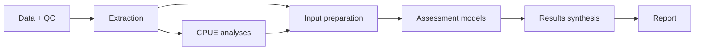

# CPUE workflow demo

An executable example connecting synthetic fishery data to CPUE indices, assessment inputs, model comparisons and a report.

[Open the demo](https://kyuhank.github.io/cpue-actions-demo/)



Analysis code lives in six repositories. CPUE alternatives use the `model-a` and `model-b` branches; assessment alternatives use `structure-1` and `structure-2`. [modules.lock.json](modules.lock.json) fixes the exact commits used together. Shared model utilities and orchestration live here.

[Extraction](https://github.com/kyuhank/cpue-demo-extract) · [CPUE](https://github.com/kyuhank/cpue-demo-cpue) · [Inputs](https://github.com/kyuhank/cpue-demo-inputs) · [Assessment](https://github.com/kyuhank/cpue-demo-assessment) · [Synthesis](https://github.com/kyuhank/cpue-demo-synthesis) · [Report](https://github.com/kyuhank/cpue-demo-report)

Select a stage to rerun it and its dependants. Verified, unchanged outputs are reused. Independent analyses run in parallel within one GitHub runner and a pinned container. The orchestration view exposes each stage’s outputs and execution records.

A versioned baseline supports intermediate starts, including after reset. Visitor runs expire ten minutes after completion; the fixed baseline remains available. A downloaded report retains its synthetic snapshot, source code, settings and replay package.

## Run locally

```bash
python3 run.py
```

Open `stages/report/outputs/report.html`. Python standard library only; the initial module download needs internet access.

The example compares two CPUE formulations and four age-structured assessment configurations. All data are synthetic; model assumptions and limitations are recorded in the report.

[Data and triggers](https://github.com/kyuhank/cpue-toy-data) · [Hosted data service](supabase/README.md) · [Container](https://github.com/PacificCommunity/ofp-sam-docker-images/tree/main/cpue-workshop)
