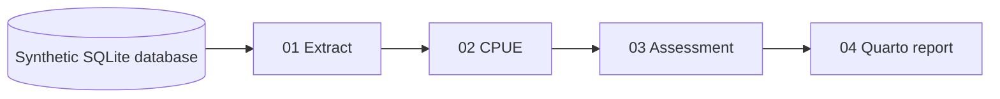

# A data update → CPUE → assessment → report

A small, public teaching demonstration using **entirely synthetic data**. A push
that changes `data/` triggers four real GitHub Actions jobs:



Each job waits for its declared parent (`needs`) and downloads that parent's
artifact. Failures stop downstream execution. The final artifact contains an
HTML report, CSV results, diagnostics, runtime records and checksums.

The CPUE comparison fits year + vessel and year-only Poisson models on the same
set records. A deterministic Schaefer model then fits each index with total
removals. This is a deliberately tiny teaching model, **not a tuna stock
assessment or management advice**. Its assumptions are documented in the report
and `pipeline/choices.json`.

No confidential data, institutional credentials, private proposal documents or
company compute services are used. Computation runs on standard GitHub-hosted
Ubuntu runners. The presentation is maintained separately in a private repository.

## Run locally

Requires Python 3.10+, base R and Quarto 1.7.31. No extra R packages are needed.

```bash
python3 pipeline/extract.py
Rscript pipeline/cpue.R
Rscript pipeline/assessment.R
python3 pipeline/report.py
```

Open `outputs/report.html`. The GitHub workflow fixes R 4.5.1 and Quarto 1.7.31,
pins action source commits, and records the runner image and input/code identity.
GitHub-hosted runner images still change; numerical repeatability must be checked
within an agreed tolerance rather than assumed to be bitwise identical.

## Trigger a data update

```bash
python3 pipeline/make_data.py --append
git add data/toy-fishery.sqlite
git commit -m "Add one synthetic year"
git push
```

Only the synthetic database changes. GitHub's `push` event automatically starts
the chain. `workflow_dispatch` can rerun the existing snapshot without adding data.
In an institutional workflow, the equivalent event would be an approved,
validated database snapshot becoming available inside its authorized environment.

## Watch in local Kflow2

The `bridge/` source adapter displays real GitHub Actions status, dependencies,
completed logs and artifacts in a separate local Kflow2 workspace. GitHub Actions
owns execution and dependency scheduling; Kflow2 supplies the monitoring view.
This demonstration does not add a general Actions execution backend to Kflow2.

Detailed launcher and rehearsal instructions are supplied in `docs/demo.md`.
