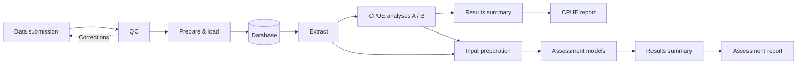

# CPUE workflow demo

An executable example connecting synthetic fishery data to CPUE indices, assessment inputs, model comparisons and a report.

[Open the demo](https://kyuhank.github.io/cpue-actions-demo/) · [Browse the synthetic database](https://kyuhank.github.io/cpue-actions-demo/data.html)



Analysis code lives in six repositories. CPUE alternatives use the `model-a` and `model-b` branches; assessment alternatives use `structure-1` and `structure-2`. [modules.lock.json](modules.lock.json) fixes the exact commits used together. Shared model utilities and orchestration live here. Adopting a module change means updating its registered commit and the data repository’s workflow pin; the workflow then invalidates that stage and its dependants.

[Extraction](https://github.com/kyuhank/cpue-demo-extract) · [CPUE](https://github.com/kyuhank/cpue-demo-cpue) · [Inputs](https://github.com/kyuhank/cpue-demo-inputs) · [Assessment](https://github.com/kyuhank/cpue-demo-assessment) · [Results summary](https://github.com/kyuhank/cpue-demo-synthesis) · [Report](https://github.com/kyuhank/cpue-demo-report)

Select a stage and a registered branch, then Run. [module-branches.json](module-branches.json) pins each choice to an exact commit; moving the branch later does not alter a saved run. Each stage has its own selection. Run applies all pending branch choices in one commit and recalculates their combined downstream paths. Verified, unchanged outputs are reused. Each module repository tests repeat execution in CI. The pipeline checks those results, then calls the module workflows on separate runners with the same pinned container. Runners prepare their software in parallel; each analysis group waits for the preceding group to finish and supply verified outputs. The orchestration view groups jobs into shared tasks, with illustrative owners, outputs and execution records. Submission, QC and loading also run as separate jobs. Failed QC returns a correction record and blocks loading. Every job produces a standalone HTML result; each module’s Pages site opens that result by run ID. The report is a short assessment update with a reproducible appendix. Card links open the database or the selected repository branch; Extract also previews its pinned SQL.

The data selector restores a published release. Data are bounded to the baseline plus one added batch; further data runs reuse that release. A versioned baseline supports intermediate starts, including after reset. Visitor runs expire ten minutes after completion; the fixed baseline remains available. A downloaded report retains its synthetic snapshot, source code, settings and replay package.

## Run locally

```bash
python3 run.py
```

Open `stages/report/outputs/report.html`. Python standard library only; the initial module download needs internet access.

The example compares two CPUE formulations and four age-structured assessment configurations. All data are synthetic; model assumptions and limitations are recorded in the report.

[Data and triggers](https://github.com/kyuhank/cpue-toy-data) · [Hosted data service](supabase/README.md) · [Container](https://github.com/PacificCommunity/ofp-sam-docker-images/tree/main/cpue-workshop)
