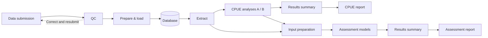

# CPUE workflow demo

A working example connecting fishery records, CPUE analyses and stock assessment. All data and models are illustrative.

[Open the demo](https://kyuhank.github.io/cpue-actions-demo/) · [Browse the database](https://kyuhank.github.io/cpue-actions-demo/data.html)

Select a starting job and code versions, then **Run**. The selected jobs and their dependants execute on GitHub Actions; unchanged outputs are reused. No visitor login is required. The orchestration view shows each job’s owner, status, logs and outputs.



## Modules

| Repository | Output |
| --- | --- |
| [Data](https://github.com/kyuhank/cpue-toy-data) | Checked database releases |
| [Extraction](https://github.com/kyuhank/cpue-demo-extract) | Records selected by SQL |
| [CPUE](https://github.com/kyuhank/cpue-demo-cpue) | Indices, comparisons and CPUE report |
| [Input preparation](https://github.com/kyuhank/cpue-demo-inputs) | Model inputs |
| [Assessment](https://github.com/kyuhank/cpue-demo-assessment) | Biomass estimates and model summaries |
| [Results summary](https://github.com/kyuhank/cpue-demo-synthesis) | Comparison plots and tables |
| [Report](https://github.com/kyuhank/cpue-demo-report) | Assessment report and reproduction bundle |

Each module has reproducibility checks. The live demo runs the selected commits in one pinned container, with parallel jobs grouped by stage. Reports record the data, code, settings, software and input/output hashes.

[module-branches.json](module-branches.json) registers selectable commits; [modules.lock.json](modules.lock.json) defines the default combination. Branch updates are adopted explicitly, so saved runs retain their original code versions.

## Run locally

```bash
python3 run.py
```

Open `stages/report/outputs/report.html`. Requires Python and internet access for the initial module download; no third-party Python packages are needed.

Visitor outputs expire ten minutes after completion. Fixed snapshots and a baseline remain available for fresh runs. Added data are limited to one batch. Downloaded reports retain their reproduction bundle.

[Hosted service and controls](supabase/README.md) · [Container source](https://github.com/PacificCommunity/ofp-sam-docker-images/tree/main/cpue-workshop)

Static sites deploy only when `docs/` or their Pages workflow changes. [The shared deployment workflow](.github/workflows/publish-pages.yml) uses a single runner and retries one failed deployment.
